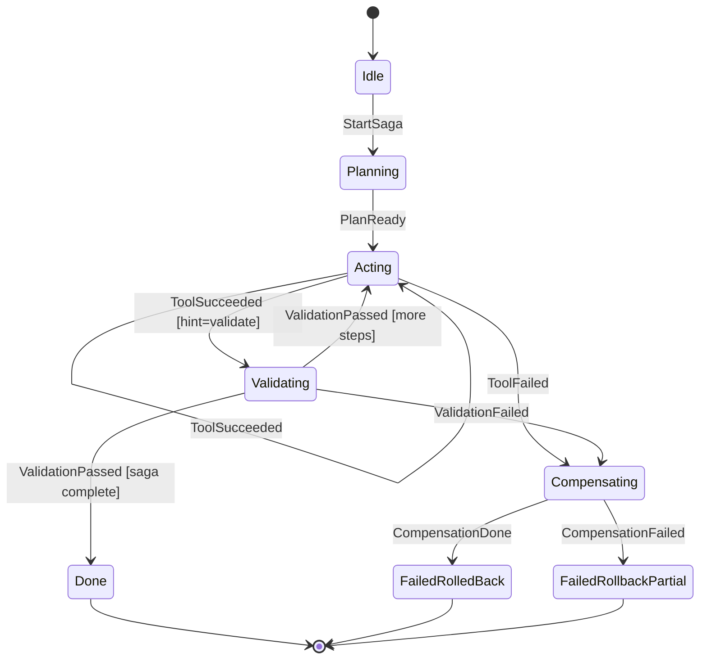

# agent-kernel — SPEC.md

> **Versione:** 0.1.0-draft
> **Stato:** In attesa di approvazione — nessun codice fino a OK.
> **Linguaggio:** Rust (edition 2021+, MSRV 1.75 per `async fn` nei trait)
> **Obiettivo:** runtime ad alte prestazioni per agenti AI con (1) rollback delle tool-call via Saga Pattern + Write-Ahead Log su SQLite e (2) esecuzione vincolata via FSM Guardrail.

---

## 0. Visione e problemi risolti

### P1 — Assenza di rollback nelle chiamate dei tool
Gli agenti AI eseguono sequenze di tool-call con effetti collaterali (file, DB, HTTP, pagamenti). Se lo step N fallisce, gli step 1..N-1 restano applicati → stato inconsistente, nessun undo semantico.

**Soluzione:** ogni tool è `TransactionalTool` con `execute` + `compensate`. Ogni esecuzione è registrata in un WAL su SQLite prima/dopo l'applicazione. Su fallimento, il Core Engine esegue compensazioni in ordine inverso (Saga Pattern).

### P2 — Esecuzione non vincolata
Senza vincoli, un LLM può invocare tool arbitrari in qualsiasi ordine (loop infiniti, exfiltrazione, scrittura prima di validazione).

**Soluzione:** una FSM centrale (`FsmGuardrail`) definisce stati legali e transizioni legali. Il `ToolDispatcher` può eseguire un tool solo se la transizione `stato_corrente + intent → nuovo_stato` è consentita.

### Non-obiettivi (per ora)
- Orchestrazione distribuita / multi-nodo.
- LLM inference (agent-kernel è model-agnostic, riceve `Intent` dall'esterno).
- Sandbox OS-level completa (solo Fase 4, locale e best-effort).

---

## 1. Architettura modulare

### 1.1 Panoramica

```text
                    +-------------------+
                    |   Agent Client    |
                    | (LLM / CLI / API) |
                    +--------+----------+
                             | Intent { tool, args, idempotency_key }
                             v
                    +--------+----------+
                    |    CORE ENGINE    |<---- policy / config
                    |  (orchestratore)  |
                    +--+------+-----+--+
                       |      |     |
              check    |      |     | dispatch
                       v      v     v
              +---------+ +--------+ +-----------+
              | FSM     | | TX LOG | | TOOL      |
              | GUARDRAIL| | (WAL)  | | DISPATCHER|
              +---------+ +---+----+ +-----+-----+
                                  |            |
                          SQLite (WAL mode)  dyn TransactionalTool
```

Flusso canonico di una singola tool-call:

1. Client invia `Intent` al `CoreEngine`.
2. `CoreEngine` chiede a `FsmGuardrail::can_transition(state, intent)`. Se no → rifiuto `E_TRANSITION_DENIED`.
3. `CoreEngine` scrive `BEGIN_STEP` sul `TxLog` (WAL su SQLite) con `saga_id`, `step_seq`, `idempotency_key`, payload.
4. `CoreEngine` chiama `ToolDispatcher::dispatch(tool_id, args)`.
5. Su `Ok(output)`: scrive `COMMIT_STEP` + avanza FSM con `on_success`. Su `Err`: scrive `FAIL_STEP` e avvia `rollback(saga_id)` → chiama `compensate` in ordine inverso, scrivendo `COMPENSATE_STEP` per ciascuna.
6. FSM avanza a `Compensating` → `FailedRolledBack` oppure `FailedRollbackPartial` (se una compensate fallisce).

### 1.2 Moduli e responsabilità

| Modulo | Responsabilità | Non fa |
|---|---|---|
| **Core Engine** (`core/`) | Orchestra Intent → FSM check → WAL write → dispatch → WAL commit/fail → rollback Saga. Possiede `SagaManager`. Zero logica di business dei tool. | Non valida policy di dominio, non esegue tool direttamente. |
| **FSM Guardrail** (`fsm/`) | Macchina a stati deterministica. Espone `can_transition`, `apply`. Configurabile via `fsm.toml` / builder. Nessun I/O. | Non conosce SQLite né i tool. Pura funzione `State x Event -> State`. |
| **Transaction Log / WAL** (`txlog/`) | Persistenza append-only su SQLite in `WAL mode`. API: `begin_step`, `commit_step`, `fail_step`, `log_compensation`, `load_saga`, `pending_sagas` (recovery al boot). Idempotency via UNIQUE constraint. | Non esegue compensazioni, non conosce la FSM. |
| **Tool Dispatcher** (`dispatcher/`) | Registry `tool_id -> Arc<dyn TransactionalTool>`. Risolve, valida args (JSON Schema / serde), esegue con timeout + concurrency limit, instrada `compensate` al rollback. | Non decide l'ordine (lo decide il Core), non scrive sul WAL direttamente. |

### 1.3 Layout repository proposto (Cargo workspace)

```text
agent-kernel/
  SPEC.md
  Cargo.toml            # workspace
  crates/
    agent-kernel-core/        # CoreEngine + SagaManager + tipi Intent/Saga
    agent-kernel-fsm/         # FsmGuardrail, stati, transizioni
    agent-kernel-txlog/       # TxLog su rusqlite
    agent-kernel-dispatcher/  # ToolDispatcher + registry
    agent-kernel-api/         # trait TransactionalTool + tipi comuni (usato da tutti)
    agent-kernel-cli/         # binario CLI (Fase 3)
```

Dipendenze previste: `tokio` (runtime), `rusqlite` (WAL), `serde`/`serde_json`, `thiserror`, `tracing`, `uuid`, `clap` (CLI Fase 3).

---

## 2. Contratti / trait Rust (`agent-kernel-api`)

### 2.1 Principi
- `async fn` nei trait (Rust 1.75+, nessun `async_trait` necessario).
- Tutti i tipi `Send + Sync + 'static` (dispatcher concorrente su Tokio).
- Compensazione **best-effort ma tracciata**: `compensate` non deve mai panicare, ritorna `Result<(), ToolError>` e viene loggata.
- Idempotenza obbligatoria: ogni `execute` riceve `ToolContext` con `idempotency_key`; implementazioni devono essere idempotenti su retry.

### 2.2 Tipi fondamentali

```rust
use serde_json::Value;
use std::collections::HashMap;

/// Identità di una esecuzione. Generata dal Core, propagata ovunque.
#[derive(Debug, Clone)]
pub struct ToolContext {
    pub saga_id: String,       // uuid v4, una saga = una task utente
    pub step_seq: u64,         // 0,1,2... ordine nella saga
    pub idempotency_key: String, // UNIQUE nel WAL: saga_id + step_seq + tool_id + hash(args)
    pub tool_id: String,
    pub state_before: String,  // snapshot FSM (es. "Planning")
    pub metadata: HashMap<String, String>, // trace_id, actor, deadline_ms...
}

/// Output normalizzato di un tool.
#[derive(Debug, Clone)]
pub struct ToolOutput {
    pub data: Value,           // payload strutturato
    pub effects: Vec<String>,  // descrizione effetti collaterali ("wrote /tmp/x", "POST /pay")
    pub next_hint: Option<String>, // suggerimento per FSM / planner ("validate", "commit")
}

/// Errori tipici. `retriable` guida il retry del Core (solo Fase 3+).
#[derive(Debug, thiserror::Error)]
pub enum ToolError {
    #[error("invalid args: {0}")]
    InvalidArgs(String),
    #[error("execution failed: {0}")]
    Execution(String),
    #[error("compensation failed: {0}")]
    Compensation(String),
    #[error("timeout after {0}ms")]
    Timeout(u64),
    #[error("transition denied: {0}")]
    TransitionDenied(String),
}
```

### 2.3 Trait principale

```rust
/// Contratto che ogni tool deve implementare.
/// Eseguibile + compensabile (Saga Pattern).
pub trait TransactionalTool: Send + Sync + 'static {
    /// ID stabile, es. "fs.write", "http.post", "db.insert".
    fn id(&self) -> &'static str;

    /// Versione per compatibilità WAL/replay.
    fn version(&self) -> &'static str { "1.0.0" }

    /// Esegue l'effetto. Deve essere idempotente su `ctx.idempotency_key`.
    async fn execute(&self, ctx: &ToolContext, args: Value) -> Result<ToolOutput, ToolError>;

    /// Annulla semanticamente un `execute` riuscito.
    /// Riceve gli stessi `args` + l'`output` originale per undo mirato.
    /// Deve essere idempotente e non fallire mai con panic.
    async fn compensate(&self, ctx: &ToolContext, args: Value, output: ToolOutput) -> Result<(), ToolError>;

    /// JSON Schema opzionale per validazione args nel Dispatcher.
    fn args_schema(&self) -> Option<Value> { None }
}
```

### 2.4 Trait di supporto (TxLog e FSM)

```rust
/// WAL minimale usato dal Core. Implementazione SQLite in `txlog/`.
pub trait TxLog: Send + Sync + 'static {
    async fn begin_step(&self, ctx: &ToolContext, args: &Value) -> Result<(), TxError>;
    async fn commit_step(&self, ctx: &ToolContext, output: &ToolOutput) -> Result<(), TxError>;
    async fn fail_step(&self, ctx: &ToolContext, err: &ToolError) -> Result<(), TxError>;
    async fn log_compensation(&self, ctx: &ToolContext, ok: bool, detail: &str) -> Result<(), TxError>;
    async fn load_saga(&self, saga_id: &str) -> Result<Vec<LoggedStep>, TxError>;
    /// Al boot: saghe con step BEGIN senza COMMIT/FAIL → da recuperare/rollback.
    async fn pending_sagas(&self) -> Result<Vec<String>, TxError>;
}

/// Guardrail sincrono e puro (nessun I/O) per testabilità.
pub trait Guardrail: Send + Sync + 'static {
    fn can_transition(&self, state: &AgentState, event: &AgentEvent) -> bool;
    fn apply(&self, state: &AgentState, event: &AgentEvent) -> Result<AgentState, GuardrailError>;
}
```

### 2.5 Esempio di implementazione

```rust
pub struct FsWriteTool;

impl TransactionalTool for FsWriteTool {
    fn id(&self) -> &'static str { "fs.write" }

    async fn execute(&self, ctx: &ToolContext, args: Value) -> Result<ToolOutput, ToolError> {
        // 1. check idempotency_key (es. se file contiene marker con key → return cached Ok)
        // 2. backup contenuto precedente in sidecar per compensate veloce
        // 3. scrittura atomica (tmp + rename)
        Ok(ToolOutput { data: args, effects: vec!["wrote file".into()], next_hint: Some("validate".into()) })
    }

    async fn compensate(&self, _ctx: &ToolContext, _args: Value, _output: ToolOutput) -> Result<(), ToolError> {
        // ripristina backup o rimuove file creato
        Ok(())
    }
}
```

### 2.6 Schema SQLite del WAL (contratto di persistenza)

```sql
PRAGMA journal_mode = WAL;

CREATE TABLE IF NOT EXISTS saga_steps (
    id              INTEGER PRIMARY KEY AUTOINCREMENT,
    saga_id         TEXT NOT NULL,
    step_seq        INTEGER NOT NULL,
    tool_id         TEXT NOT NULL,
    idempotency_key TEXT NOT NULL UNIQUE,   -- garantisce exactly-once logico
    args            TEXT NOT NULL,          -- JSON
    output          TEXT,                   -- JSON, NULL fino a COMMIT
    status          TEXT NOT NULL,          -- BEGIN | COMMIT | FAIL | COMPENSATED | COMPENSATION_FAILED
    error           TEXT,                   -- messaggio ToolError se FAIL
    created_at      TEXT NOT NULL DEFAULT (datetime('utc','now')),
    updated_at      TEXT NOT NULL DEFAULT (datetime('utc','now')),
    UNIQUE (saga_id, step_seq)
);
CREATE INDEX IF NOT EXISTS idx_saga ON saga_steps(saga_id, step_seq);
```

---

## 3. Macchina a stati finiti (FSM)

### 3.1 Stati

| Stato | Significato | Tool ammessi (esempio) |
|---|---|---|
| `Idle` | Nessuna saga attiva. | — |
| `Planning` | L'agente pianifica i passi. | `planner.*` (read-only) |
| `Acting` | Esecuzione tool con effetti. | `fs.*`, `http.*`, `db.*` registrati |
| `Validating` | Verifica post-azione. | `validator.*`, `fs.read`, `http.get` (read-only) |
| `Compensating` | Rollback Saga in corso. Solo `compensate`. | — (nessun `execute` ammesso) |
| `Done` | Saga committata con successo. Terminale. | — |
| `FailedRolledBack` | Saga fallita ma compensata. Terminale. | — |
| `FailedRollbackPartial` | Compensazione fallita, serve intervento. Terminale. | — |

### 3.2 Eventi

```rust
pub enum AgentEvent {
    StartSaga,                 // Idle -> Planning
    PlanReady,                 // Planning -> Acting
    ToolSucceeded,             // Acting -> Acting | Validating (se next_hint == "validate")
    ToolFailed,                // Acting -> Compensating
    ValidationPassed,          // Validating -> Acting (continua) | Done (se saga completa)
    ValidationFailed,          // Validating -> Compensating
    CompensationDone,          // Compensating -> FailedRolledBack
    CompensationFailed,        // Compensating -> FailedRollbackPartial
}
```

### 3.3 Diagramma



### 3.4 Tabella delle transizioni (normativa)

| Da | Evento | A | Nota guardrail |
|---|---|---|---|
| `Idle` | `StartSaga` | `Planning` | Solo se nessuna saga attiva per quell'attore |
| `Planning` | `PlanReady` | `Acting` | Richiede piano non vuoto |
| `Acting` | `ToolSucceeded` | `Acting` / `Validating` | `Validating` solo se tool read-only successivo o hint |
| `Acting` | `ToolFailed` | `Compensating` | Avvia rollback automatico, blocca nuovi `execute` |
| `Validating` | `ValidationPassed` | `Acting` / `Done` | `Done` solo se tutti gli step COMMIT |
| `Validating` | `ValidationFailed` | `Compensating` | Come sopra |
| `Compensating` | `CompensationDone` | `FailedRolledBack` | Tutti i COMMIT hanno `COMPENSATED` |
| `Compensating` | `CompensationFailed` | `FailedRollbackPartial` | Almeno un `COMPENSATION_FAILED`, richiede operatore |

### 3.5 Regole di enforcement
1. **Default-deny:** transizione non in tabella → `TransitionDenied`.
2. **Blocco execute in compensazione:** in `Compensating` il Dispatcher rifiuta ogni `execute`, accetta solo `compensate` chiamato dal Core.
3. **Read-only in Planning/Validating:** in questi stati solo tool marcati `read_only = true` possono fare `execute`.
4. **Persistenza stato:** `CoreEngine` salva `(saga_id, state)` nella tabella `saga_state` (Fase 2) per recovery al boot insieme a `pending_sagas`.
5. **Configurabilità:** transizioni extra solo via `fsm.toml` esplicito + test. Nessuna transizione dinamica da prompt LLM.

---

## 4. Roadmap in 4 fasi incrementali

### Fase 1 — WAL & Rollback (Saga core)
**Obiettivo:** rollback funzionante senza FSM né dispatcher completo.
- [ ] `agent-kernel-api`: `ToolContext`, `ToolOutput`, `ToolError`, trait `TransactionalTool`, trait `TxLog`.
- [ ] `agent-kernel-txlog`: SQLite + WAL, schema §2.6, `begin/commit/fail/log_compensation/load/pending`.
- [ ] `agent-kernel-core`: `SagaManager::run(steps)` minimale — esegue `execute` in sequenza, su errore chiama `compensate` in reverse, logga tutto.
- [ ] 2 mock tool (`OkTool`, `FailOnNTool` + compensate contabile) + test: `rollback_inverso`, `idempotency_retry`, `recovery_pending_sagas`.
- [ ] Criterio di done: `cargo test` verde; kill -9 a metà saga → al riavvio `pending_sagas` rilevata e rollback completato.
- **Non fare:** FSM, CLI, timeout/concorrenza, sandbox.

### Fase 2 — FSM Guardrail
**Obiettivo:** esecuzione vincolata.
- [ ] `agent-kernel-fsm`: `AgentState`, `AgentEvent`, `FsmGuardrail` + `fsm.toml`, tabella §3.4 come test parametrizzati.
- [ ] Integrazione in `Core`: ogni `Intent` passa da `can_transition`; `Compensating` blocca `execute`.
- [ ] Tabella `saga_state(saga_id PRIMARY KEY, state, updated_at)` + recovery stato al boot.
- [ ] Test: transizione illegale rifiutata, loop `Acting` lecito, `ToolFailed → Compensating → FailedRolledBack`.
- [ ] Criterio di done: fuzzing semplice delle transizioni (1000 eventi random, nessun panic, solo transizioni legali applicate).
- **Non fare:** CLI, sandbox.

### Fase 3 — Tool Dispatcher & CLI
**Obiettivo:** usabilità e robustezza operativa.
- [ ] `agent-kernel-dispatcher`: registry, validazione `args_schema`, timeout per tool, limite concorrenza (semaphore), tracing.
- [ ] 3 tool reali: `fs.read`/`fs.write` (atomico + backup), `http.get`, `noop`.
- [ ] `agent-kernel-cli`: `run --plan plan.json`, `rollback --saga <id>`, `log --saga <id>`, `fsm --show`.
- [ ] Retry solo per errori `retriable` + idempotency_key stabile; `plan.json` esempio end-to-end.
- [ ] Criterio di done: demo CLI `write → validate → fail → rollback` ripristina file originale; `cargo clippy -- -D warnings` pulito.
- **Non fare:** sandbox OS-level.

### Fase 4 — Sandboxing locale
**Obiettivo:** contenimento best-effort degli effetti reali.
- [ ] Policy `sandbox.toml`: allowlist path, domini HTTP, dimensione max I/O, deny-by-default.
- [ ] Enforcement nel Dispatcher (pre-check) + tool `fs.*` confinati a root consentita (canonicalize + prefix check, no symlink escape).
- [ ] Dry-run mode: `execute` simula senza effetti ma produce output valido per planner.
- [ ] Audit log firmato (hash chain su `saga_steps`) + test di escape (symlink, `..`, redirect HTTP).
- [ ] Criterio di done: tentativi fuori-policy bloccati con `TransitionDenied`/`PolicyDenied` + audit verificabile; doc `THREAT_MODEL.md`.
- **Non fare:** container/VM, seccomp eBPF (futuro).

---

## Appendice — Domande per approvazione

1. OK layout workspace `crates/*` e MSRV 1.75?
2. OK schema WAL con `UNIQUE(idempotency_key)` + `UNIQUE(saga_id, step_seq)`?
3. OK stati terminali `Done / FailedRolledBack / FailedRollbackPartial`?
4. Priorità Fase 1 confermata (prima WAL, poi FSM)?

> **Prossimo passo dopo OK:** `cargo init` workspace + `agent-kernel-api` con tipi §2.2–§2.3 e test di compilazione.

---

## 5. Fase 5 — Distribuzione plugin, observability di esempio, release hygiene
> **Stato:** proposta — implementazione SOLO dopo approvazione esplicita.

Contesto: il runtime è completo (Fasi 1–4, crate `sagashield` v0.1.0). La Fase 5
chiude i 4 gap di distribuzione richiesti per l'ecosistema Claude Code, senza
toccare il core (`src/` invariato salvo quanto strettamente necessario).

### 5.1 — MCP Plugin Manifest (`.claude-plugin/marketplace.json`)

**Obiettivo:** installazione one-command via `/plugin marketplace add` in Claude Code.

- [ ] Creare `.claude-plugin/marketplace.json` con metadati marketplace:
  `name` (`sagashield`), `description` (allineata a `Cargo.toml`),
  `version` sincronizzata con `Cargo.toml`/`pyproject.toml` (`0.1.0`),
  `owner`, e array `plugins[]` con entry del plugin (nome, `source: "./"`,
  descrizione, versione, riferimento alla config MCP in `integrations/`).
- [ ] JSON valido e campi obbligatori verificabili in modo meccanico
  (parse + assert delle chiavi in CI o via `jq`).
- [ ] Criterio di done: file committato, JSON valido, versione coerente con
  il crate; README/integrations rimandano al marketplace.
- **Non fare:** modifiche al protocollo MCP, nuovi tool, rename del binario.

### 5.2 — OTEL Example (`examples/otel_export.rs`)

**Obiettivo:** dimostrare l'esportazione audit OTel verso stdout.

- [ ] Nuovo example che: apre un WAL (in-memory), esegue una mini-saga
  (2 step OK + 1 crash con rollback LIFO) tramite `AgentKernel`, chiama
  `AuditExporter::export_session_otel_json` e stampa il documento su stdout.
- [ ] Output = JSON `resourceSpans` parsabile (stesso formato di
  `kernel_export_audit`); nessun file scritto, nessun side-effect residuo.
- [ ] Criterio di done: `cargo run --example otel_export` esce 0 e stampa su
  stdout un JSON valido con `resourceSpans[0].scopeSpans[0].spans.length >= 3`.
- **Non fare:** exporter di rete, dipendenze OTel runtime, telemetria live.

### 5.3 — CHANGELOG (`CHANGELOG.md`, Keep a Changelog)

**Obiettivo:** storia delle release conforme a [Keep a Changelog](https://keepachangelog.com/).

- [ ] Creare `CHANGELOG.md` con sezioni `## [0.1.0]` (contenuto rilasciato:
  WAL/Saga, FSM, dispatcher, sandbox Step-0, MCP server, idempotenza,
  replay, audit OTel, binding Python, eval suite 50 scenari) e
  `## [Unreleased]` (voce `v0.2.0-unreleased` con i task di Fase 5).
- [ ] Categorie standard (`Added` / `Changed` / `Fixed` / `Security`),
  link di confronto versioni in calce, data `2026-09-08` per `0.1.0`.
- [ ] Criterio di done: formato validato a vista contro lo standard;
  `RELEASING.md` resta la fonte per la policy SemVer.
- **Non fare:** retrodatare feature non rilasciate, duplicare `SPEC.md`.

### 5.4 — Verifica CI Fuzzing (smoke run)

**Obiettivo:** i target libFuzzer compilano e girano (breve) in CI.

- [ ] Verificare/estendere lo script `fuzz/run_fuzz.bat` (e controparte per
  CI Linux) con parametri di smoke: budget temporale corto
  (es. `-max_total_time=60`), `max_len` limitata, directory `artifacts/`.
- [ ] Estendere `.github/workflows/ci.yml` con job `fuzz-smoke`:
  toolchain nightly + `cargo-fuzz`, `cargo fuzz build` dei target
  `path_guard` / `net_guard`, smoke run limitato; il job fallisce su
  crash, timeout o target non compilabili.
- [ ] Il corpus deterministico resta su stable (`security_fuzz_test`,
  1.300+ input); il fuzzing coverage-guided resta nightly-only.
- [ ] Criterio di done: CI verde incluso il nuovo job; script eseguibile in
  locale su Windows (`.bat`) con prerequisiti documentati.
- **Non fare:** fuzzing illimitato in CI, sanitizer diversi da quelli
  supportati dal target, gate di merge su conteggio crash storici.

---

## Appendice Fase 5 — Domande per approvazione

1. OK campo `owner`/nome marketplace e versione `0.1.0` in `marketplace.json`?
2. OK example OTel in-memory con mini-saga 2 OK + 1 crash (nessun file)?
3. OK CHANGELOG con `0.1.0` datato e `Unreleased` → `0.2.0`?
4. OK job CI `fuzz-smoke` nightly con budget 60s (non bloccante oltre i crash)?

> **Nessuna modifica al codice finché non approvi i 4 punti sopra.**
